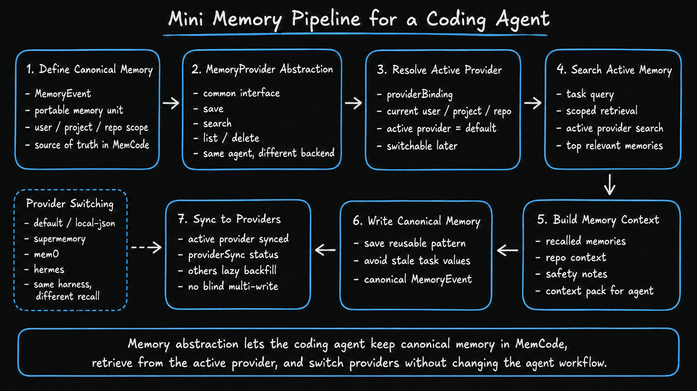
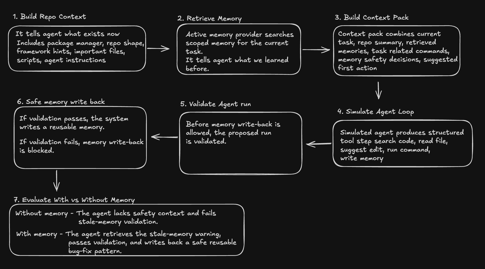
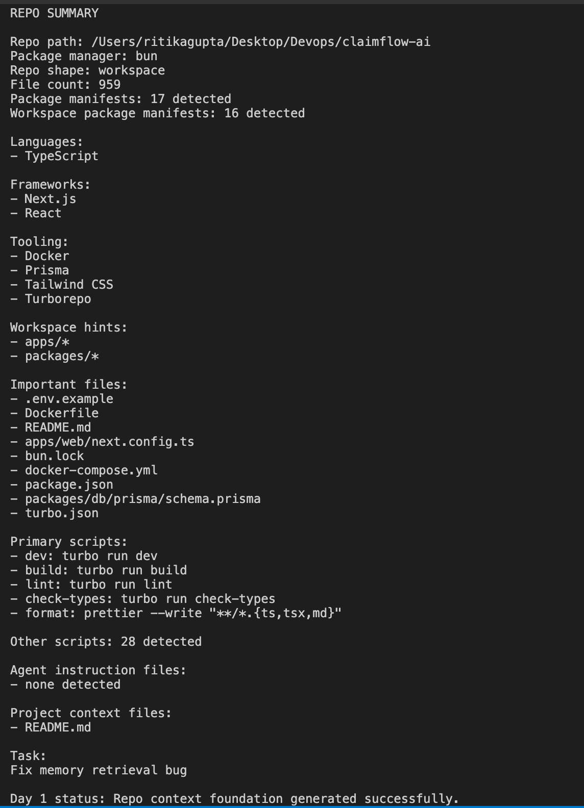
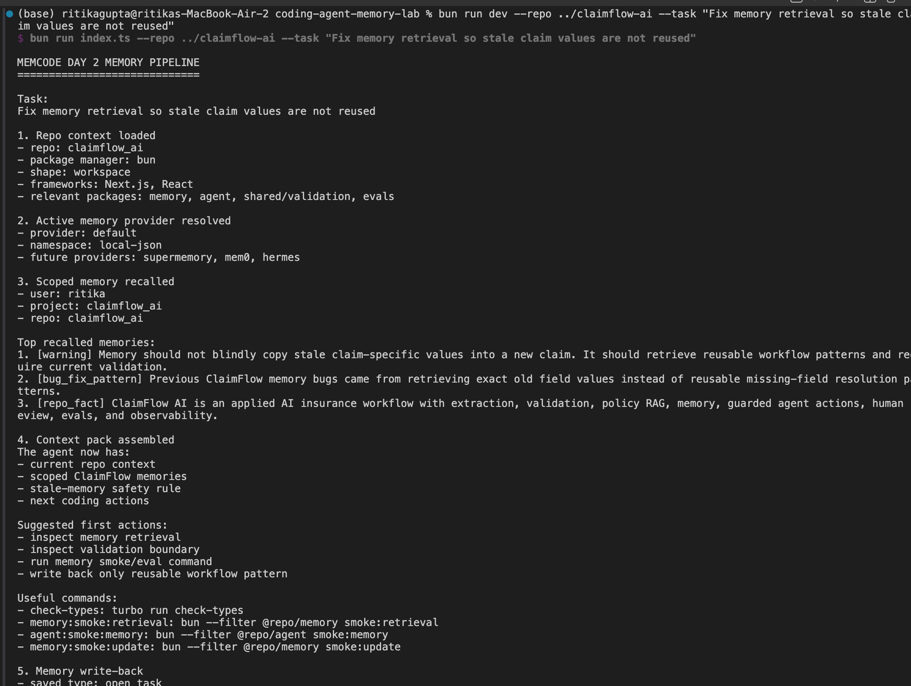
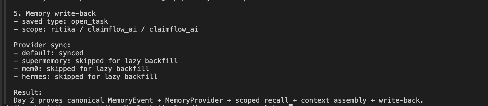
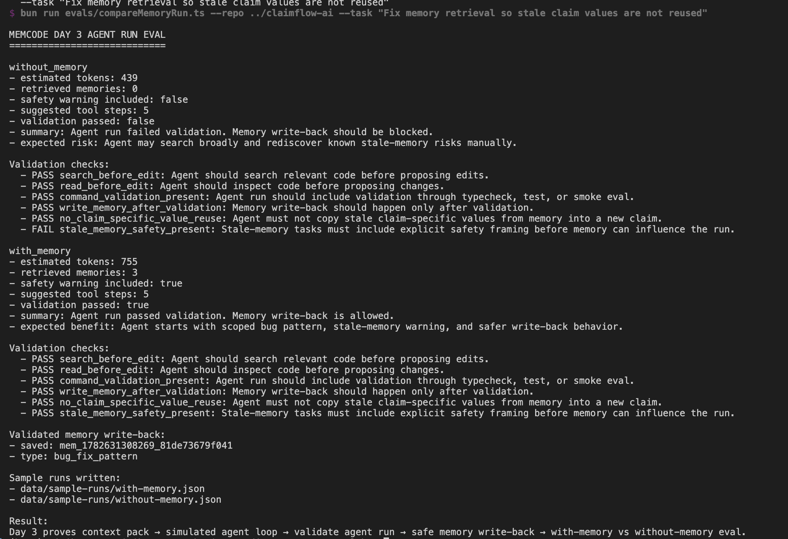

# Coding Agent Memory Lab

A 3-day proof of work for understanding how **memory abstraction can be added to a coding-agent runtime**.

This repo explores the core MemCode idea:

> A coding agent should not only understand the current repo.  
> It should also recall what was learned before, use that memory safely, and allow developers to switch memory providers without changing the agent workflow.

---

## Core idea

Most coding agents today let users choose the **model**.

This project explores the next abstraction:

```text
same coding agent
same repo
same task
different memory provider
different recall behavior
```

A memory provider should not be treated as only a database.

A database answers:

```text
What was stored?
```

A memory provider answers:

```text
What should be recalled for this coding task right now?
```

That is why this repo models memory providers as **recall engines**.

---

## Memory abstraction for a coding agent

The memory layer is designed so the coding-agent harness does not care which memory backend is active.

```text
MemoryEvent
  = canonical memory unit owned by MemCode

MemoryProvider
  = interface every memory backend implements

LocalMemoryProvider
  = default JSON-backed recall engine

ProviderBinding
  = decides active provider for user/project/repo

ProviderSyncStatus
  = tracks which providers have synced memory
```



This lets the agent use:

```text
default / local-json today
supermemory later
mem0 later
hermes later
```

without rewriting the coding-agent loop.

Detailed architecture notes:

- [Memory layer engineering challenges](./docs/memory-layer-engineering-challenges.md)
- [When to switch memory providers](./docs/when-switch-memory-providers.md)

---

## Why provider switching matters

A developer may want to switch memory providers because each provider can recall differently.

For the same task:

```text
Fix memory retrieval so stale claim values are not reused
```

different providers may behave differently:

```text
Supermemory
→ broad project/document context

Mem0
→ durable learned patterns across sessions

Hermes-style/default
→ local curated memory and coding-agent runtime rules
```

The important architecture decision is:

```text
Provider switching should not move the whole product state.
It should only switch the recall behavior.
```

MemCode keeps canonical memory events. Providers act as adapters/recall engines.

---

## Coding-agent mini pipeline

This repo does not build a full autonomous coding agent.

It builds the minimum pipeline needed to prove how memory fits inside a coding-agent runtime:



The pipeline is:

```text
Build repo context
  ↓
Retrieve memory
  ↓
Build context pack
  ↓
Simulate agent loop
  ↓
Validate agent run
  ↓
Safe memory write-back
  ↓
Evaluate with vs without memory
```

### 1. Repo context

The agent first needs to understand what exists now.

The repo context includes:

```text
package manager
repo shape
framework hints
important files
scripts
agent instructions
```

Proof:



---

### 2. Memory layer and recall engine

The active memory provider searches scoped memory for the current task.

Scope keeps retrieval grounded:

```text
user / project / repo
```

The local provider scores memories using:

```text
keyword match
scope match
type boost
importance boost
confidence
```

This turns memory into a recall engine instead of simple storage.

Proof:





---

### 3. Context pack

The context pack combines:

```text
current task
repo summary
retrieved memories
task-relevant commands
memory safety decisions
suggested first actions
```

For a real coding agent, this is the compact working context sent before the agent enters the tool loop.

---

### 4. Simulated agent loop

The agent does not act freely.

It acts through structured tool steps:

```text
search_code
read_file
suggest_edit
run_command
write_memory
```

This models the Agent-Computer Interface idea: coding agents need structured commands and feedback, not raw unrestricted actions.

---

### 5. Validation before write-back

Memory should not be blindly trusted.

Before memory write-back is allowed, the proposed agent run is validated.

Validation checks:

```text
search before edit
read before edit
validation command included
write-back after validation
no stale claim-specific value reuse
stale-memory safety framing present
```

If validation fails:

```text
memory write-back is blocked
```

If validation passes:

```text
only reusable learning is written back
```

Example reusable memory:

```text
When fixing memory retrieval, reuse workflow patterns but require current evidence before applying claim-specific values.
```

---

## With-memory vs without-memory eval

The same task is evaluated in two modes:

```text
without_memory = repo context only
with_memory    = repo context + retrieved scoped memory
```

### Without memory

The agent has:

```text
current task
repo summary
important files
generic coding steps
```

But it lacks the stale-memory safety lesson.

Result:

```text
shorter context
no stale-memory safety framing
validation fails
memory write-back blocked
```

### With memory

The agent also receives retrieved memories such as:

```text
do not reuse stale claim-specific values
previous memory bugs came from exact old value reuse
memory should suggest reusable workflow patterns only
current validation must own current truth
```

Result:

```text
retrieves relevant memories
includes safety framing
validation passes
safe reusable memory is written back
```

Proof:



The point is not that memory always reduces tokens.

The point is:

```text
without memory = shorter but unsafe
with memory    = more context but passes validation
```

---

## What was built and tested

This repo proves the following system behavior:

```text
1. Build compact repo context
2. Resolve active memory provider
3. Retrieve scoped memories for the current task
4. Score and rank memories
5. Assemble context pack
6. Simulate agent tool loop
7. Validate the proposed run
8. Write memory only if validation passes
9. Track provider sync status
10. Compare with-memory vs without-memory behavior
```

Final tested result:

```text
without_memory
→ validation failed
→ memory write-back blocked

with_memory
→ validation passed
→ reusable bug-fix memory written back
```

---

## How this maps to MemCode

MemCode should not be a wrapper around one memory provider.

It should be a **provider-independent memory harness for coding agents**.

The architecture should look like:

```text
MemCode DB
  = canonical source of truth

MemoryEvent
  = portable memory unit

MemoryProvider
  = adapter interface

ProviderBinding
  = active memory selection

ProviderSyncStatus
  = lazy/backfill control

PromptAssembler
  = repo summary + instructions + retrieved memory

CodingAgentHarness
  = repo context + tools + validation + memory write-back
```

This avoids:

```text
provider lock-in
duplicate writes
high latency
high cost
provider drift
unsafe stale memory reuse
```

---

## Run locally

Install dependencies:

```bash
bun install
```

Seed demo memories:

```bash
bun run seed
```

Run the main memory pipeline:

```bash
bun run dev \
  --repo ../claimflow_ai \
  --task "Fix memory retrieval so stale claim values are not reused"
```

Run the with-memory vs without-memory eval:

```bash
bun run eval \
  --repo ../claimflow_ai \
  --task "Fix memory retrieval so stale claim values are not reused"
```

Typecheck:

```bash
bun run check
```

---

## Final takeaway

This repo proves a minimal memory-aware coding-agent pipeline:

```text
Repo context tells the agent what exists now.
Memory tells the agent what was learned before.
Validation decides whether memory was used safely.
Provider abstraction lets the developer switch recall engines without changing the agent workflow.
```

The core product insight:

> Memory is not just storage.  
> For coding agents, memory is scoped recall, safe context injection, validated write-back, and provider-independent continuity.
